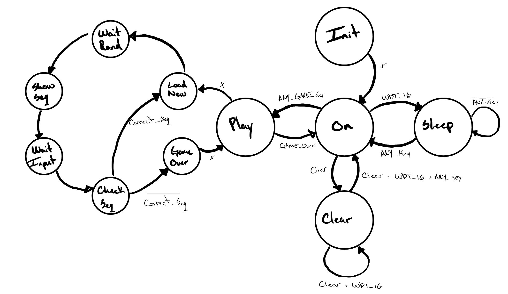

# Project: Simon Says
### Isander Paris Santiago

---

## Project Description

This repository was used to document and share my code while building a digital version of the classic Simon Says game on the Basys3 FPGA board. Here you will find the VHDL entities and the constraints file used in the project, but if you want to run and implement the code, you will need to build the project in Vivado.

The design applies finite state machine (FSM) principles, sequential logic, and I/O handling. The game generates a random sequence of colors that the user must repeat using the buttons. Each round adds one more color to the sequence. If the player makes a mistake or does not respond within 16 seconds, the game ends.

---

## I/O Mapping

- **LEDs `[15:0]`** — Divided into 4 groups of 4, one per color (Red, Green, Yellow, Blue)
- **7-segment display** — Shows the current score and the high score
- **Buttons `W19, U17, T17, T18`** — User input, color selection
- **Button `U18`** — Start / confirm
- **Switch `R2`** — Game reset
- **Switches `V16, V17`** — Difficulty control
- **Output pin (external buzzer)** — Generates a different tone for each color

---

## Main Entities

- **`key_controller`** — Reads button inputs and returns a stable debounced signal
- **`wdt`** — Sends an alert signal if 16 seconds have passed without user activity
- **`rand_gen`** — Randomly selects among the 4 colors to build the game sequence
- **`game_controller`** — Main state machine that coordinates all phases of the game
- **`display`** — Converts the numeric score to the corresponding 7-segment display encoding
- **`buzzer`** — Converts each color into an audio frequency and emits it through the output pin
- **`top_module`** — Interconnects all modules and maps signals to the physical pins of the Basys3

---

## Diagrams

**State Diagram**

The figure below shows the state diagram used to build the game. This was the first step in the programming process and was later revised until its final version shown.

**Entities Diagram**

The figure below shows every interconnection between the entities used for the implementation of the game.

## How to Implement in Vivado

1. Create a new project in Vivado targeting the Basys3 (`xc7a35tcpg236-1`)
2. Add all `.vhd` files from the `source/` folder as design sources
3. Add the `.xdc` file from `constraints/` as a constraints source
4. Run Synthesis → Implementation → Generate Bitstream
5. Connect the Basys3 and program it using the Hardware Manager